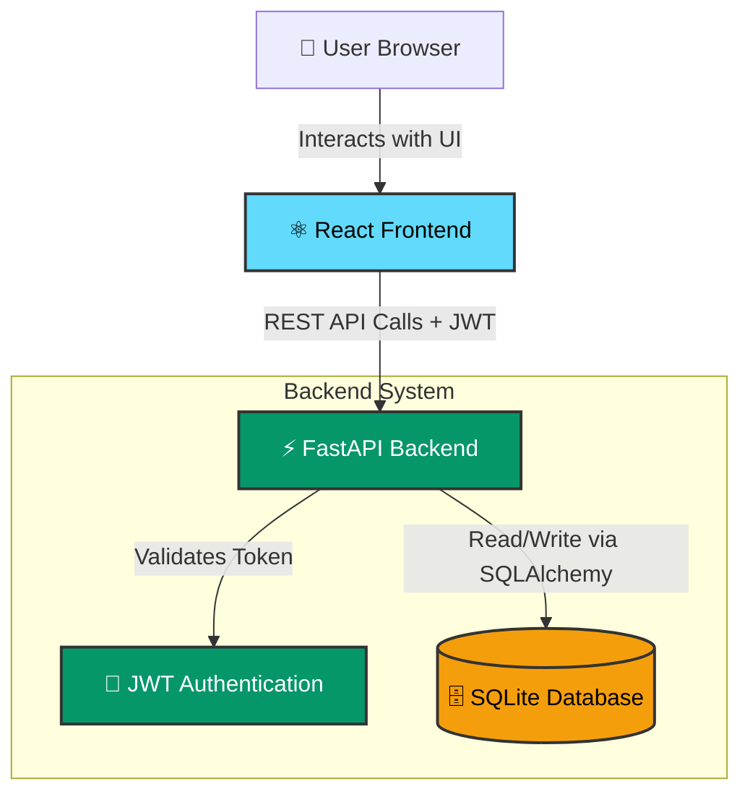

# Task Manager Pro 

A full-stack, role-based project and task management application designed for seamless team collaboration and workflow tracking.

## 🌟 Key Features
- **Role-Based Access Control (RBAC):** Distinct permissions for 'Admin' and 'Member' roles.
- **Project Management:** Admins can create and manage multiple workspaces/projects.
- **Task Delegation:** Admins can assign specific tasks to team members.
- **Kanban Board:** Interactive board to track tasks across 'To Do', 'In Progress', and 'Done' stages.
- **Overdue Tracking:** Automatic visual indicators for tasks that have passed their due date.
- **Secure Authentication:** Robust JWT-based user authentication and password hashing.

## 🛠️ Tech Stack
- **Frontend:** React.js, Vite, Tailwind CSS, Lucide Icons
- **Backend:** FastAPI, Python, SQLAlchemy
- **Database:** SQLite
- **Authentication:** JWT (JSON Web Tokens), bcrypt

## 🏗️ System Architecture

The application follows a standard client-server architecture with a clear separation of concerns between the frontend and backend.



## ⚙️ How to Run Locally

### Backend Setup
1. Navigate to the backend directory: 
   ```bash
   cd Backend
   ```
2. Create and activate a virtual environment:
   ```bash
   python -m venv .venv
   # For Windows:
   .\.venv\Scripts\activate
   # For Mac/Linux:
   source .venv/bin/activate
   ```
3. Install dependencies:
   ```bash
   pip install -r requirements.txt
   ```
4. Run the development server:
   ```bash
   uvicorn main:app --reload
   ```
   *The backend will run at `http://127.0.0.1:8000`*

### Frontend Setup
1. Open a new terminal and navigate to the frontend directory:
   ```bash
   cd frontend
   ```
2. Install dependencies:
   ```bash
   npm install
   ```
3. Start the Vite development server:
   ```bash
   npm run dev
   ```
   *The frontend will run at `http://localhost:5173`*

---
*Developed by Bipin Kumar*
